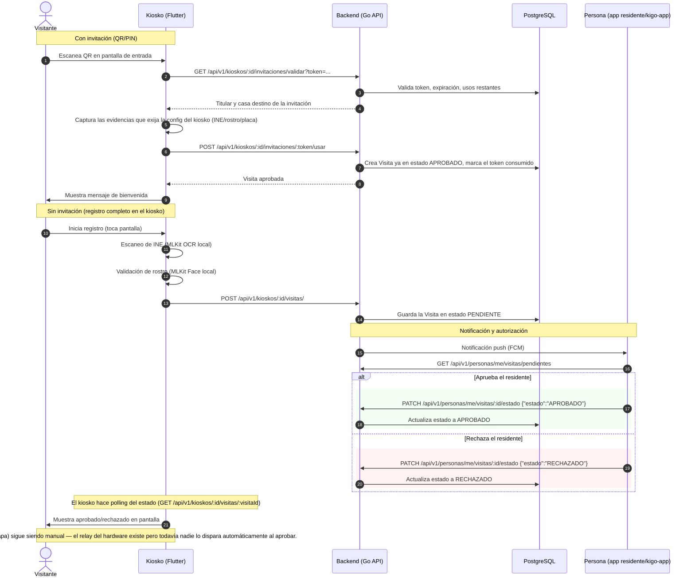

# Diagrama de Secuencia del Sistema

Este documento detalla las interacciones técnicas, llamadas a la API y el orden temporal de los eventos entre los componentes de **AUTOnomIA**. Hay dos flujos de entrada distintos según si el visitante trae invitación (QR/PIN generado desde la app) o no.

El dashboard de admin puede resolver la misma visita con `PATCH /api/v1/visitas/:id/estado` (fuera de este diagrama, mismo efecto que la respuesta del residente).
