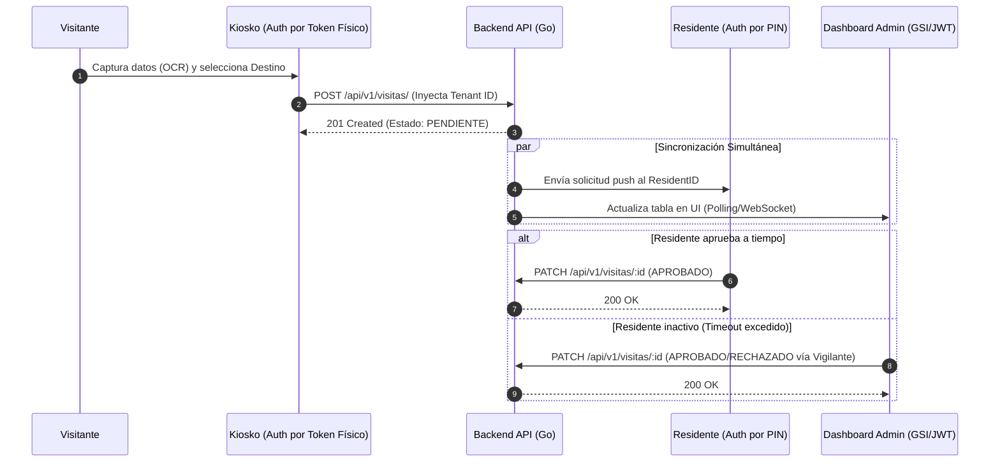
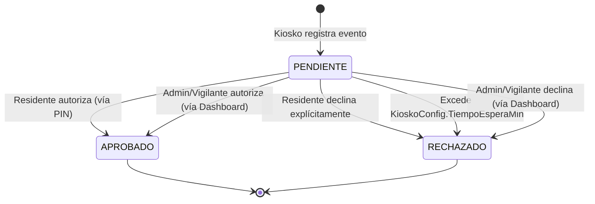

# Diagramas de Sistema: AUTOnomIA Backend

Los siguientes diagramas ilustran las interacciones lógicas y los ciclos de vida de las entidades principales definidos por los Architecture Decision Records (ADRs).

## 1. Flujo de Registro, Sincronización y Aprobación
Este diagrama de secuencia detalla cómo interactúan las tres interfaces (Kiosko, Residente, Dashboard) con la API central para procesar un nuevo acceso.

## 2. Máquina de Estados de la Visita

El ciclo de vida de una Visita es estrictamente controlado a nivel de aplicación y base de datos para evitar modificaciones arbitrarias, operando como un evento inmutable.

## 3. Flujo de Invitaciones mediante Token Opaco (Pre-autorización)
Este diagrama ilustra el proceso definido en el ADR-0017 donde un residente genera una invitación con un token opaco y el kiosko la procesa de forma transaccional.

```mermaid
sequenceDiagram
    autonumber
    participant R as Residente (App)
    participant B as Backend API (Go)
    participant V as Visitante
    participant K as Kiosko (Terminal)

    R->>B: POST /residentes/me/invitaciones
    B-->>R: Devuelve Token Opaco (Hex 64 chars)
    R->>V: Comparte QR con el Token
    V->>K: Presenta código QR en la caseta
    K->>B: GET /kioskos/:id/invitaciones/validar?token=XXX
    B-->>K: 200 OK (Datos del invitado)
    
    rect rgb(30, 30, 30)
        Note over K,B: Bloque de ejecución y consumo
        K->>B: POST /kioskos/:id/visitas (Tipo: INVITADO)
        B-->>K: 201 Created
        K->>B: POST /kioskos/:id/invitaciones/:token/usar
        B-->>K: Incrementa ConteoUsos (Revoca atómicamente si alcanza MaxUsos)
    end
```

