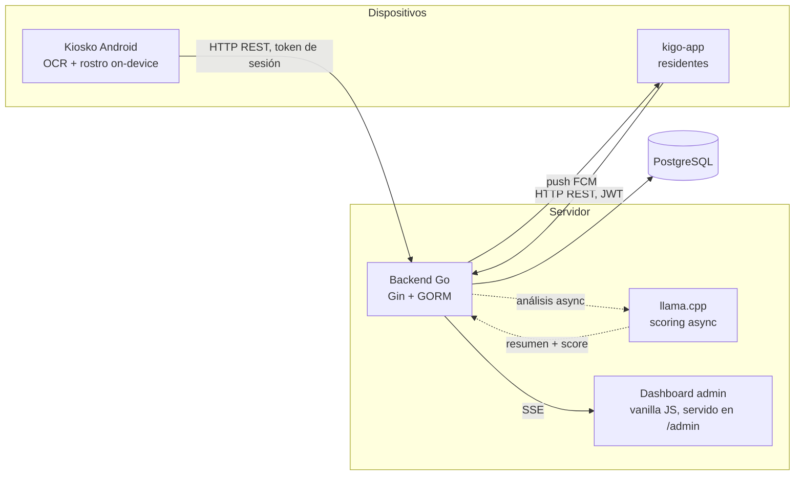
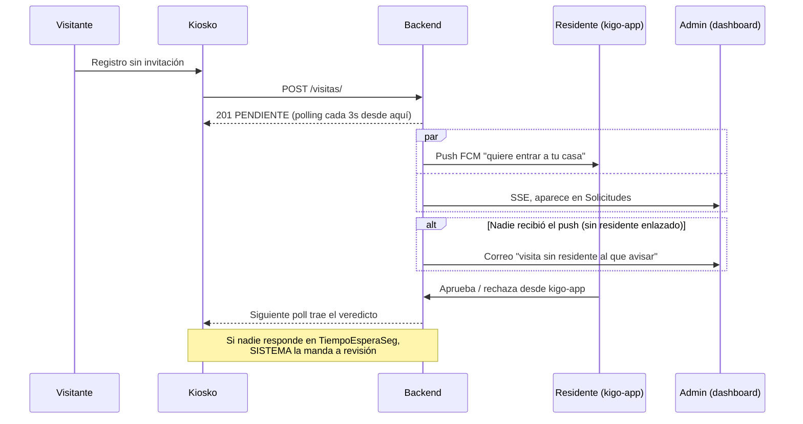
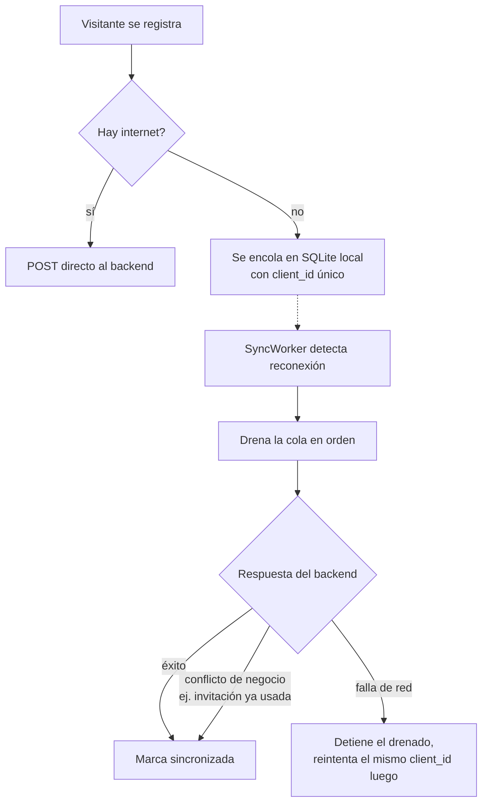

# FAQ técnica — preparación para FEPRO / Kigo

Respuestas cortas y honestas a las preguntas que pueden hacernos jueces o el equipo de Kigo
sobre las decisiones técnicas de AUTOnomIA. Cada sección: qué es, por qué lo elegimos, y qué
responder si nos aprietan con el "¿y por qué no X?".

---

## Arquitectura general

**¿Qué es el sistema?**
Un backend Go (Gin + GORM + PostgreSQL) como única fuente de verdad, un dashboard web que el
propio backend sirve en `/admin`, y dos apps Flutter: el kiosko (Android, self-checkin) y
kigo-app (Android/iOS, para residentes). La IA de scoring corre en el servidor (llama.cpp); el
ML de visión (OCR de INE, detección y reconocimiento de rostro) corre **en el dispositivo** del
kiosko con MLKit y un modelo TFLite propio, sin APIs externas.

**¿Por qué el dashboard es vanilla y no React?**
Un solo `index.html` + `app.js` + `styles.css`, sin bundler. Decisión deliberada (ADR 0009/0010):
cero dependencias de build, se sirve directo desde el binario Go, y el equipo lo puede depurar con
el inspector del navegador sin toolchain. Para el alcance de un panel de administración es
suficiente; si creciera a decenas de vistas, reconsideraríamos.

**¿Por qué Flutter?**
Un solo código por app, buen soporte de cámara y MLKit, y el equipo ya lo conocía. El kiosko y
kigo-app son proyectos Flutter separados (no comparten código) porque su UI, su modelo de auth y
su ciclo de vida son distintos: uno es un dispositivo fijo desatendido, el otro un teléfono
personal.

---

## Nuestro segmento: comunidad cerrada / horizontal

FEPRO asigna un segmento de acceso real de Kigo por equipo. El nuestro es **fraccionamiento con
caseta, acceso vehicular** — el anfitrión es la casa destino, filtra un vigilante, y el dato
distintivo es la placa. Esto no es un detalle de negocio suelto: explica varias decisiones
técnicas que de otro modo parecerían sobre-ingeniería.

- **`DestinoID` en vez de solo texto libre**: casa destino empezó como un string (`"Casa 12"`) y
  hoy resuelve a un `Destino` real con calle/tipo/número — necesario para agrupar por calle,
  contar residentes por casa y filtrar visitas por destino en el dashboard.
- **`Placa` como identificador de visita sin documento** (ADR 0024): en acceso vehicular no
  siempre hay una INE que fotografiar — la matrícula es lo único garantizado.
- **La vista de análisis de IA en el kiosko, detrás de PIN de operador**: el PRD del reto nombra
  explícitamente "una vista de consulta para el vigilante" como el foco de excelencia de este
  segmento. Ver sección "La IA" más abajo.

---

## Multi-tenant

**¿Qué significa que el sistema es multi-tenant?**
Una sola instalación (un backend, una base de datos) sirve a varios clientes independientes. Cada
`CentroHabitacional` (fraccionamiento, plaza, campus…) es un *tenant*. Comparten servidor y
tablas, pero sus datos están aislados: un admin solo ve sus kioskos, residentes y visitas.

**¿Cómo se aísla?**
Por columna discriminadora: toda tabla de dominio tiene `tenant_id` (migración 000025). El
middleware de auth extrae el tenant del JWT o de la sesión del kiosko y lo inyecta en el contexto;
los repositorios aplican scopes de GORM que añaden `WHERE tenant_id = ?`. Para consultas con JOIN
usamos `ByTenantFor(tabla)`, que califica la columna (`visitas.tenant_id`) para evitar ambigüedad
SQL (ADR 0021).

**¿Cada admin es un tenant?**
Cada admin *dueño* crea su propio `CentroHabitacional` al registrarse. Los vigilantes que ese
admin da de alta heredan su tenant (no crean uno).

**¿Una persona puede pertenecer a más de un centro?**
Sí. Una `Persona` (identidad de kigo-app) puede tener varias `Membresia` activas, una por cada
`CentroHabitacional` al que se unió — vive en un edificio y visita seguido la casa de un familiar
en otro fraccionamiento, por ejemplo. kigo-app deja elegir el centro activo desde un selector; el
backend nunca mezcla datos de dos tenants en la misma respuesta.

**¿Y si un programador olvida el filtro en una consulta nueva?**
Respuesta honesta: hoy esa consulta vería datos de todos los tenants. El aislamiento vive en el
código, no en la base de datos. La mitigación conocida es **Row-Level Security de PostgreSQL**:
políticas en la BD que filtran filas por tenant aunque el código olvide el `WHERE`
(`CREATE POLICY ... USING (tenant_id = current_setting('app.tenant_id'))`). Está en el roadmap;
no lo implementamos aún porque exige propagar el tenant a nivel de conexión y el alcance de FEPRO
priorizó funcionalidad. Sabemos exactamente cómo añadirlo.

**¿Por qué no una base de datos por cliente?**
Costo operativo: N bases = N migraciones, N backups, N conexiones. El modelo de columna
discriminadora es el estándar SaaS (Slack, Shopify empezaron así) y escala hasta muy tarde.

---

## Identidad y autenticación (hay cuatro, y es a propósito)

Principio: **menor privilegio por tipo de interfaz** (ADR 0004).

| Actor | Mecanismo | Por qué |
|---|---|---|
| Admin / vigilante | JWT (HS256, 24 h), login con correo/contraseña o Google | Humano con sesión corta; stateless, no toca BD por request |
| Kiosko | **Token de sesión opaco persistido en BD** | Dispositivo desatendido que debe poder **revocarse al instante** desde el dashboard (JWT no se puede revocar sin lista negra) |
| Persona (kigo-app) | JWT, login con teléfono + código OTP (por SMS o correo) | Usuario final: el teléfono es el ancla de identidad, no una contraseña que se le olvida |
| Residente en el kiosko | PIN (bcrypt) o reconocimiento facial 1:N, sin JWT | Auto-checkin frente al kiosko — no hay teclado cómodo para escribir un correo, y el PIN es memorizable |

**¿Qué pasó con el modelo `Residente`?**
Se eliminó por completo — modelo, tabla, handlers y JWT propio. La identidad de un residente hoy
es `Persona` (teléfono + OTP, la misma que usa kigo-app) y su relación con un centro es una
`Membresia`. El login por PIN o rostro **desde el kiosko** no cambió de contrato (mismas rutas),
pero por dentro ya consulta `Persona` + `Membresia`.

**¿Dos residentes de la misma casa pueden compartir PIN?**
Si coinciden, el kiosko no adivina: muestra un selector con los candidatos (nombre + casa) para
que la persona elija la suya. Antes resolvía al primer match, que era el bug real.

**¿JWT vs token opaco — por qué los dos?**
JWT: el servidor no guarda nada, verifica la firma; ideal para humanos con sesiones cortas.
Opaco en BD: cada request consulta la tabla `sesion_kioskos`; más costoso pero **revocable** — al
eliminar un kiosko robado, su siguiente petición recibe 401 y el dispositivo vuelve solo a la
pantalla de activación.

**¿Los PINs están en claro?**
No. bcrypt (hash adaptativo con salt). Igual las contraseñas de admin y la clave de kiosko.

---

## ¿Por qué no solo reconocimiento facial, sin QR? (kigo-app ya toma fotos)

Pregunta esperable: si residentes e invitados casi siempre traen kigo-app, y esa app ya les
tomó una foto (perfil, Kigo Verify), ¿por qué no matchear esa foto y quitar el QR por completo?

**Ya lo hacemos — para quien ya está enrolado.** Un residente, o un "invitado frecuente"
(`Membresia.Rol = RolInvitadoFrecuente`, `PermiteReconocimientoFacial = true`), en su
*segunda* visita en adelante **no vuelve a mostrar QR**: el kiosko lo reconoce por rostro 1:N
directo (`residente_acceso_view.dart`, mismo bucle para ambos roles — "no hay reconocimiento de
segunda clase para un invitado frecuente", dice el comentario en
`persona/handlers.go:CrearInvitadoFrecuente`). El QR no es un paso permanente.

**Lo que el QR sí sigue resolviendo, y por qué no se puede saltar:**

1. **El emparejamiento de la primera vez.** `Handler.VerificarQR` (`persona/handlers.go:813`) es
   el único punto donde una identidad firmada criptográficamente (el QR, Ed25519 sobre
   `persona_id`) se empareja con un rostro **capturado ahí mismo, por la cámara del kiosko**, con
   la luz y el ángulo reales de esa puerta — "enrolamiento oportunista", dice el código. Sin ese
   emparejamiento, un vector facial no tiene ninguna prueba de a quién pertenece.
2. **Una selfie de perfil no es una selfie de acceso.** La foto que kigo-app toma (perfil, KYC de
   Kigo Verify) se autorizó para OTRO fin. Reusarla en silencio para matching biométrico continuo
   de acceso mezcla dos consentimientos distintos — pisa el principio de **finalidad** de la
   LFPDPPP (dato biométrico usado para un fin distinto al autorizado).
3. **No todo el que necesita entrar quiere o puede estar enrolado.** Un proveedor, un repartidor,
   una visita de una sola vez — obligarlos a instalar la app y enrolar su cara ANTES de poder
   cruzar la puerta mata el caso "invito a alguien en 10 segundos", que es el corazón de este
   segmento. El QR (o INE+rostro para quien ni teléfono registrado tiene) cubre a quien el
   reconocimiento facial puro no puede atender: no hay nada contra qué reconocerlos todavía.

---

## Activación del kiosko (RFC 8628)

**¿Qué es eso del código de 8 letras?**
El *OAuth 2.0 Device Authorization Grant* — el mismo flujo con el que una smart TV te hace teclear
un código en el teléfono. El kiosko pide un código (`XXXX-XXXX`), lo muestra con QR, y hace polling
cada 5 s mientras el admin lo escribe y aprueba en el dashboard. Al aprobarse, el kiosko recibe su
sesión (ADR 0019).

**¿Por qué así y no teclear una clave en el kiosko?**
Invertimos la dirección: el secreto largo nunca se transcribe a mano ni se muestra al humano; el
código corto se teclea donde hay teclado real. El código expira en 15 min, usa charset sin vocales
(no forma palabras) y exige un admin autenticado para aprobarse.

**Debilidad conocida:** el endpoint de polling es público y sin rate limiting. Adivinar el
`device_code` (32 bytes aleatorios) es impracticable, pero limitaríamos la tasa antes de producción.

---

## Tiempo real y notificaciones

Los mecanismos vivos:

1. **SSE dashboard** (`/kioskos/solicitudes/stream`): las solicitudes nuevas aparecen sin refrescar.
2. **SSE config del kiosko** (`/kioskos/:id/config/stream`): cambiar tema/idioma/fotos desde el
   dashboard se aplica en caliente en el dispositivo.
3. **Polling del kiosko tras registrar visita** (cada 3 s): espera el veredicto
   (APROBADO/RECHAZADO/REVISION) para mostrarlo al visitante.
4. **Push FCM a kigo-app**: al residente cuando llega una visita que necesita su autorización, y
   también cuando un invitado con QR/rostro entra auto-aprobado ("ya entró tu visita").
5. **Correo al admin como respaldo**: si nadie recibe el push (destino sin residente enlazado, o
   ninguno con la app instalada), un correo avisa a los admins del tenant — sin esto, la solicitud
   quedaba esperando en silencio si nadie miraba el dashboard.

**¿Por qué SSE y no WebSockets?**
El flujo dashboard↔servidor es unidireccional (servidor → cliente). SSE es HTTP plano: pasa por
cualquier proxy, reconecta solo, y no necesita protocolo propio. WebSockets se justificaría con
tráfico bidireccional, que ahí no tenemos (ADR 0014).

**¿Por qué FCM y no otra cosa para el push?**
Estándar de facto para Android/iOS, gratis, y Flutter lo soporta de fábrica. Si no hay credenciales
de Firebase configuradas, el sistema cae solo a un notificador que solo loguea (`LogPushSender`) —
nunca truena por falta de configuración (ADR 0029).

---

## Modo offline del kiosko

Si se cae la red a mitad de un fraccionamiento, el kiosko no debe dejar de registrar accesos.

- **`LocalCacheDb`** (SQLite en el dispositivo) guarda un snapshot de destinos, residentes con
  huella facial e invitaciones activas — para que el kiosko pueda operar sin red, no solo encolar.
- Cada registro offline lleva un **`client_id`** generado en el dispositivo: si el mismo registro
  se reintenta dos veces (ej. el kiosko se reinicia a medio drenado), el backend lo reconoce y no
  duplica la visita.
- **Conflicto de negocio vs. falla de red son cosas distintas**: una invitación ya consumida por
  otro kiosko offline al mismo tiempo es un rechazo legítimo (se descarta el registro encolado);
  un timeout de red detiene el drenado entero para no perder ni duplicar nada.
- El LED del kiosko cambia a **ámbar** mientras no hay internet — señal ambiental para el
  vigilante, no para el visitante.

---

## La IA

**¿Qué hace exactamente?**
Dos cosas separadas que no hay que confundir:

1. **Visión on-device (kiosko):** OCR de la INE y detección/reconocimiento de rostro con Google
   MLKit + un modelo TFLite propio (MobileFaceNet), corriendo en el dispositivo. Nada sale a APIs
   externas — privacidad y funcionamiento sin latencia de red. El OCR corrige confusiones típicas
   (O↔0, I↔1) apoyándose en la estructura fija de la CURP.
2. **Scoring en servidor:** al registrar una visita, una goroutine evalúa el historial de ese
   visitante (recurrencia, anomalías de placa, horario inusual, rechazos previos, calidad de la
   evidencia) y arma un score de confianza 0-100, **explicable**: cada factor que suma o resta
   queda guardado, no es una caja negra. Un LLM local (llama.cpp) redacta el resumen narrativo a
   partir de esos mismos factores — nunca decide él solo, solo lo explica en español.

**¿Dónde se ve el análisis?**
Se divide en dos audiencias, porque los factores negativos del score (placa distinta a la
habitual, rechazo previo, CURP con formato inválido) son señales de fraude — mostrárselas a la
persona que está siendo evaluada sería filtrarle exactamente lo que sospechamos de ella.

- **El visitante** (en el kiosko, mientras espera) ve solo un sello: *"Verificado por IA ·
  Confianza alta/media/baja"*. Nada de factores.
- **El vigilante** puede tocar ese sello, meter su PIN de operador, y ver el detalle completo:
  factores, recomendaciones, resumen. Es la vista de consulta que el PRD del reto pide para este
  segmento.
- El **dashboard admin** y **kigo-app** (para el residente de esa casa) ya mostraban esto antes;
  kigo-app recibe una versión filtrada — nunca los factores que comparan contra el historial del
  visitante en *otras* casas del fraccionamiento, para no filtrarle a un residente que alguien fue
  rechazado en la casa del vecino.

**¿Qué pasa si el LLM está apagado o no responde?**
El score (el número, los factores) es **puramente determinista** — no depende del LLM en
absoluto. Solo el resumen narrativo cae a un texto heurístico armado con plantillas. Las tres
apps muestran una nota discreta ("análisis automático, asistente no disponible") en vez de
presentar el heurístico como si fuera redacción del LLM.

**¿Por qué llama.cpp local y no OpenAI/Claude?**
Datos personales (INE, CURP, rostros) no salen de nuestra infraestructura; costo cero por
inferencia; funciona sin internet. El trade-off es capacidad del modelo, aceptable porque el LLM
solo redacta resúmenes — el scoring es lógica determinista.

**¿El autopass es seguro?**
Solo aprueba si: score de confianza sobre el umbral configurado **y** cero anomalías bloqueantes
(rechazo previo, placa distinta, CURP sospechosa) **y** el admin tiene autopass habilitado.
Cualquier bloqueante manda a revisión humana sin importar qué tan alto sea el score. Todo queda
en bitácora auditable con foto y con quién autorizó.

---

## Hardware del kiosko (Telpo F10)

El dispositivo objetivo trae lector QR y LED RGBW integrados, controlados vía el SDK propio del
fabricante (`PosUtil`, expuesto a Flutter por un `MethodChannel` nativo en Kotlin).

- **Lector QR**: funciona como teclado HID — el hardware ya entrega el texto leído, no hace falta
  cámara ni librería de decodificación en la app.
- **LED RGBW**: cuatro canales independientes y aditivos (rojo/verde/azul/blanco, no un selector
  de color exclusivo). Verde para aprobado, rojo para rechazado, blanco de apoyo durante captura,
  y **ámbar sin conexión** — logrado prendiendo rojo+verde a la vez, porque el hardware no tiene
  un canal ámbar dedicado.
- **Modo kiosko real** (`startLockTask`/`stopLockTask` de Android): el dispositivo no sale de la
  app sin el PIN de operador, y el bloqueo se re-arma solo si el sistema lo soltó (ej. al volver
  de segundo plano).
- **Fuera de alcance del reto** (explícito en el PRD): fabricación de kiosko físico, torniquete,
  pluma o barrera — el control de acceso físico (chapa/torniquete) lo abre hoy un humano, no el
  sistema.

---

## Base de datos

**¿Por qué PostgreSQL?**
Relacional (el dominio es relacional: tenants→kioskos→visitas), soporte de RLS para el roadmap de
aislamiento, y es el estándar que Kigo puede operar.

**¿Migraciones?**
Versionadas con archivos SQL numerados (`000001`–`000066`), up/down, aplicadas con golang-migrate.
Nada de auto-migrate de GORM en producción: queremos control exacto del esquema.

**¿Borrado de datos?**
Soft-delete (columna `deleted_at`) en todo el dominio: la bitácora es auditable, nada se destruye.

---

## Puntos débiles que admitimos si preguntan

Decir esto con franqueza da más credibilidad que esconderlo:

- **Sin RLS**: el aislamiento multi-tenant depende del código; una consulta sin scope fugaría
  datos. Roadmap claro para añadirlo.
- **Sin rate limiting** en el endpoint público de activación de kioskos.
- **Sin CI**: los checks (build, tests, analyze) corren a mano, no en cada push.
- **URLs del backend hardcodeadas** en las apps para el entorno de demo.
- **Cola offline solo para el flujo de registro de visitas**: otros flujos del kiosko (login de
  residente por PIN/rostro, invitación, QR de kigo-app) sí encolan, pero el snapshot local
  (`LocalCacheDb`) tiene que estar fresco de antes — si el kiosko nunca tuvo red, no tiene con qué
  operar offline.
- **Dependencia externa inestable si se integra Kigo Verify**: en pruebas manuales, 2 de 5
  enrolamientos de prueba se quedaron atorados indefinidamente en un estado no terminal. Por eso
  la mini-app del reto usa solo `kigo.auth.init()` (confirmado estable) y no el flujo de
  enrolamiento facial completo en la demo en vivo.

---

## Chuleta de siglas

- **Tenant / multi-tenant**: cliente aislado dentro de una instalación compartida.
- **RLS**: Row-Level Security — Postgres filtra filas por política, aunque el código olvide el WHERE.
- **JWT**: token firmado autocontenido; el servidor no guarda sesión.
- **Token opaco**: cadena aleatoria que solo significa algo consultando la BD; revocable.
- **SSE**: Server-Sent Events — el servidor empuja eventos por una conexión HTTP abierta.
- **RFC 8628**: Device Authorization Grant — activación de dispositivos sin teclado con código corto.
- **OTP**: One-Time Password — código de un solo uso, aquí para verificar el teléfono de una Persona.
- **bcrypt**: hash adaptativo para contraseñas/PINs, con salt y costo configurable.
- **FCM**: Firebase Cloud Messaging — push real a móviles, con respaldo a un notificador falso si no está configurado.
- **MLKit**: ML de Google on-device (OCR, rostros); no manda datos a la nube.
- **TFLite**: TensorFlow Lite — formato de modelo que corre on-device (aquí, MobileFaceNet).
- **HID**: Human Interface Device — el lector QR se comporta como teclado, no como cámara.
- **Soft-delete**: marcar como borrado (`deleted_at`) sin destruir la fila.
- **GORM scope**: función reutilizable que añade condiciones a una consulta (así inyectamos el tenant).
